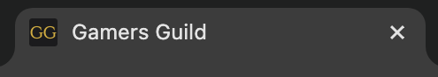
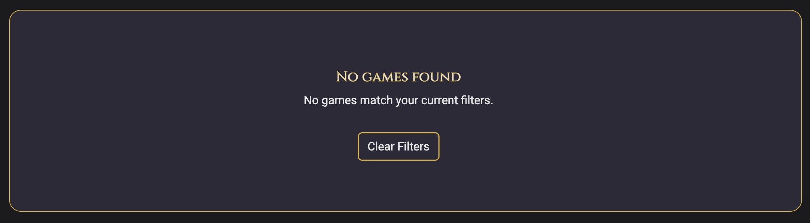
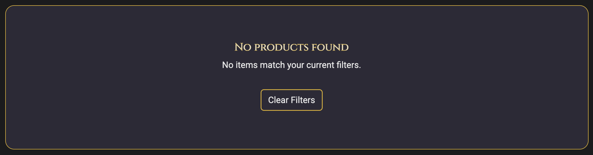

# Gamers Guild

Deployed link: [Gamers Guild](https://gamers-guild-18d9a6433da1.herokuapp.com/ "Gamers Guild | Heroku")

## Contents
* [Project Overview](#project-overview)
* [User Goals](#user-goals)
* [User Stories](#user-stories)
* [Project Goals and Objectives](#project-goals-and-objectives)
* [Target Audience](#target-audience) 
* [Wireframes](#wireframes)
* [Design Choices](#design-choices)
  + [Typography](#typography)
  + [Colour Scheme](#colour-scheme)
  + [Images](#images)
* [Security Measures and Protective Design](#security-measures-and-protective-design)
  + [User Authentication](#user-authentication)
  + [Password Management](#password-management)
  + [Form Validation](#form-validation)
  + [Database Security](#database-security)
* [Features](#features)
  + [Core Features](#core-features)
  + [Page Features](#page-feastures)
  + [Shop Features](#shop-features)
* [Future Enhancements](#future-enhancements)  
* [Technologies Used](#technologies-used)  
  + [Languages](#languages)  
  + [Libraries and Frameworks](#libraries-and-frameworks)  
  + [Tools and Programmes](#tools-and-programmes)  
* [Database Design and Data Modelling](#database-design-and-data-modelling)  
  + [Data Model](#data-model)  
  + [Entity Relationship](#entity-relationship)  
  + [Entity Relationship Diagram](#entity-relationship-diagram)  
* [Testing](#testing)  
  + [Bugs](#bugs)  
  + [Responsiveness Tests](#responsiveness-tests)  
  + [Code Validation](#code-validation)  
  + [Automated Testing](#automated-testing)  
  + [User Story Testing](#user-story-testing)  
  + [Feature Testing](#feature-testing)  
  + [Error Page Testing](#error-page-testing)  
  + [Accessibility Testing](#accessibility-testing)  
  + [Lighthouse Testing](#lighthouse-testing)  
  + [Browser Testing](#browser-testing)  
* [Deployment](#deployment)  
  + [Local Deployment](#local-deployment)  
  + [Heroku Deployment](#heroku-deployment)  
* [Credits](#credits)
  + [Feedback, advice and support](#feedback-advice-and-support)
  + [Learning Resources and Guidance](#learning-resources-and-guidance)
  + [Images](#images)
  + [Content](#content)
  + [Visual Content](#visual-content) 

----------------------------------------------

## Project Overview
Gamers Guild is a full stack Django web application designed to bring gamers together within a shared, community-driven platform. The application enables users to browse a curated collection of games, explore detailed game pages, and engage with other users through interactive features such as comments and reviews.

The platform prioritises clarity, usability, and meaningful interaction, avoiding unnecessary complexity or distractions. By focusing on community-driven content rather than algorithm-heavy recommendations, Gamers Guild encourages users to share experiences, discover new games organically, and contribute to a collaborative environment.

Built using Django, the project demonstrates full CRUD functionality, secure authentication, and relational database design. It showcases the integration between backend logic and frontend presentation, ensuring a seamless and responsive experience across all devices.

In addition to its community features, Gamers Guild includes an integrated shop that allows users to browse and purchase gaming-related accessories and add-ons. These include items such as game pieces, branded accessories, and enhancements that complement gameplay. This expands the platform beyond discussion into a more complete user experience, while also demonstrating e-commerce functionality within a full stack application.

**Purpose:**

The purpose of Gamers Guild is to provide a welcoming and interactive platform where gamers can explore, discuss, and share their experiences in a structured and engaging environment.

Many existing gaming platforms rely heavily on advertisements, or algorithm-driven suggestions, which can limit authentic interaction. Gamers Guild addresses this by prioritising user-generated content, allowing users to communicate through review comments rather than relying solely on numerical systems.

The inclusion of a shop enhances this experience by connecting community interaction with practical user needs. Users can move seamlessly from discovering games and engaging in game reviews to purchasing related accessories and enhancements, creating a cohesive and engaging user journey.

**Key objectives include:**

- Encourage open discussion and sharing of gaming experiences  
- Support discovery of new games through community insight  
- Provide a clean, distraction-free interface  
- Demonstrate secure and scalable Django development  
- Integrate e-commerce functionality within a community platform   

**Target Audience:**

Gamers Guild is designed for a broad range of users who engage with gaming content in different ways:

- Casual gamers looking to discover new games and read community opinions  
- Enthusiast gamers who enjoy reading reviews, and sharing experiences  
- Beginner to intermediate players seeking guidance and recommendations  
- Users who prefer community-driven platforms over commercial review sites  
- Players interested in saving and organising favourite games  
- Individuals who value a clean, user-friendly interface  

The platform also appeals to users interested in gaming-related purchases:

- Gamers looking for accessories, collectibles, or add-ons  
- Users who enjoy customising their gaming experience  
- Players who value the convenience of browsing and purchasing within one platform 

**Platform:**

Gamers Guild is a fully responsive web application, ensuring usability across desktop, tablet, and mobile devices.

The platform supports multiple levels of user interaction:

- **Public Users**  
  Can browse games, view details, and read review comments without registering  

- **Authenticated Users**  
  Can register, log in, post, edit, and delete review comments, and save favourite games  

- **Administrators**  
  Have full control over content, including managing games, moderating user-generated content, and maintaining platform quality  

The platform also includes an integrated shop system:

- **Shop Functionality**  
  Users can browse products, view detailed descriptions, and make purchases  

- **Authenticated Users (Extended Features)**  
  Logged-in users can purchase items, enhancing engagement and usability  

- **Administrators (Shop Control)**  
  Admins can manage inventory, including adding, editing, and removing products  

The application is deployed online and built with scalability, security, and maintainability in mind using Django’s built-in tools and best practices.

[Back to contents](#contents)

---------------------------------------------

## User Goals

- Browse and discover new games easily  
- Read and contribute to community discussions  
- Create an account to interact with content  
- Save favourite games for quick access  
- Access the platform across multiple devices  
- Purchase gaming-related products easily and securely  
- Explore and customise their gaming experience through accessories and add-ons

[Back to contents](#contents)

---------------------------------------------

## User Stories

| User Story | Expected Outcome | Pass Criteria | Evidence |
|------------|----------------|---------------|----------|
| As a public user, I want to browse a list of games and view individual game details so that I can explore the content without registering. | Public users can see game titles, images, descriptions, and links to more details. | Game list displays correctly, detail pages load without login. |  |
| As a new user, I want to register an account securely so that I can participate in discussions and save favorites. | Users can register with validation, receive success feedback, and verify account details. | Registration form validates input and displays confirmation message. |  |
| As a registered user, I want to log in securely so that I can access my profile and interact with content. | Users can log in with credentials, authentication protects private data. | Login form accepts valid credentials and denies invalid attempts. |  |
| As a logged-in user, I want to post reviews or comments on games so that I can share my opinions and interact with other users. | Comments/reviews are posted under the game, with moderation if needed. | Comment form works and displays posted reviews after submission. |  |
| As a user, I want to edit my own reviews/comments so that I can correct mistakes or update my opinion. | Users can update their own comments, changes are saved and marked as edited. | Only comment author can edit, edit confirmation displayed. |  |
| As a user, I want to delete my own reviews/comments so that I can remove content I no longer want visible. | Users can delete their own comments after confirmation, removed content is gone from display. | Delete confirmation and success feedback function correctly. |  |
| As a registered user, I want to save my favorite games so that I can easily revisit them later. | Users can “favorite” games and view a personal list in their profile. | Favorite button toggles correctly, saved games appear in user profile. |  |
| As an admin, I want to add new games or content so that fresh material is available to the community. | Admins can create new games through the admin panel, new content appears on the site. | Admin can create game entries with images, description, and metadata. |  |
| As an admin, I want to edit existing games or content so that I can correct errors or update information. | Admins can update game details, changes reflect immediately on front end. | Changes are saved successfully and visible to users. |  |
| As an admin, I want to delete outdated or inappropriate games so that the content remains current and safe. | Admins can remove content, confirmed via admin panel, removed items no longer appear to users. | Delete confirmation displayed, database updated correctly. |  |
| As an admin, I want to moderate user comments/reviews so that inappropriate or spam content is removed. | Admins can approve, decline, or delete comments, moderation reflected on front end. | Only admins can perform moderation, moderated content is hidden or removed. |  |
| As a public or registered user, I want responsive design so that the website works well on mobile, tablet, and desktop. | Website layout adjusts seamlessly across devices. | No broken elements, navigation and content are readable at all screen sizes. |  |
| As a user, I want to browse products in the shop so that I can explore available gaming accessories. | Users can view a list of products with images, names, and prices. | Product list loads correctly and displays all items. |  |
| As a user, I want to view detailed product information so that I can make informed purchase decisions. | Users can access individual product pages with descriptions and details. | Product detail pages display correct information. |  |
| As an authenticated user, I want to add items to my cart so that I can purchase multiple products. | Users can add items to a cart and update quantities. | Cart updates correctly when items are added. |  |
| As a user, I want to complete a purchase securely so that I can buy products safely. | Users can complete checkout with secure handling of data. | Checkout process completes successfully with confirmation. |  |
| As an admin, I want to add products to the shop so that new items can be made available. | Admin can create product entries via admin panel. | New products appear in the shop. |  |
| As an admin, I want to edit products so that I can update pricing or descriptions. | Admin can update product details. | Changes reflect on frontend. |  |
| As an admin, I want to delete products so that outdated items are removed. | Admin can remove products from the database. | Deleted products no longer appear. |  |

[Back to contents](#contents)

---------------------------------------------

## Project Goals and Objectives

[Back to contents](#contents)

---------------------------------------------

## Wireframes

Wireframes were created using [Canva](https://www.canva.com/ "Canva | Homepage"). A mobile first approach was taken throughout, the wireframes provide a visual representation of the expected layout and structure of the website. Within the wireframes, key element placement is visible for navigation, content and interactive areas. Differences to the Wirefrmaes may occur during the development of the website where improvments are implimented.

[Mobile Wireframes](docs/mobile-wireframes.pdf "Mobile Wireframes")

[Tablet Wireframes](docs/tablet-wireframes.pdf "Tablet Wireframes")

[Desktop Wireframes](docs/desktop-wireframes.pdf "Desktop Wireframes")

[Back to contents](#contents)

---------------------------------------------

## Design Choices

### Typography

[Google Fonts](https://fonts.google.com/ "Google Fonts") was used to import and apply typography consistently across the application using CSS. Typography was carefully selected to reflect the medieval-fantasy theme of Gamers Guild while maintaining strong readability and accessibility.

- **Cinzel** is used for headings and titles to create a bold, immersive aesthetic inspired by classic engraved lettering. This enhances the thematic identity of the platform and complements the gold accent colour used throughout the design.

- **Roboto** is used for body text to ensure clarity and readability across all devices. Its clean and modern appearance balances the more decorative heading font, preventing visual fatigue and improving the overall user experience.

This combination ensures a clear visual hierarchy while maintaining both aesthetic appeal and usability.

### Colour Scheme

[Coolors](https://coolors.co/1b1b1d-2c2a36-d4af37-e6e6e6-b63e3e-4c8c4a "Coolors") was used to create a fitting colour scheme for Gamers Guild, it has been designed to create a dark, immersive medieval-fantasy atmosphere while maintaining strong usability and readability. A deep near-black (`#1B1B1D`) serves as the primary background to reduce eye strain and establish a moody foundation, complemented by a slightly lighter accent (`#2C2A36`) to add depth and separation between sections such as cards and panels. A rich gold (`#D4AF37`) is used for highlights, buttons, and key UI elements, evoking themes of treasure, armor, and prestige while standing out clearly against the dark background. A muted red (`#B63E3E`) provides contrast for alerts and important feedback, reinforcing a fantasy tone associated with danger or urgency. An additional complementary green (`#4C8C4A`) is used for success messages and positive user feedback. This earthy, muted tone fits naturally within the medieval-fantasy palette, resembling forest and herbal hues often associated with healing and vitality, while still providing clear visual distinction from error states. Finally, a soft off-white (`#E6E6E6`) ensures high readability for text without the harshness of pure white. Together, these colours create a cohesive, thematic interface that balances aesthetic immersion with accessibility and clear visual hierarchy. 

[Contrast Grid](https://contrast-grid.eightshapes.com/?version=1.1.0&background-colors=&foreground-colors=%231B1B1D%0D%0A%232C2A36%0D%0A%23D4AF37%0D%0A%23E6E6E6%0D%0A%23B63E3E%0D%0A%234C8C4A&es-color-form__tile-size=regular&es-color-form__show-contrast=aaa&es-color-form__show-contrast=aa&es-color-form__show-contrast=aa18&es-color-form__show-contrast=dnp "Contrast Grid") was used to determine the best colour combinations to ensure the website was visually appealing whilst remaining easy for the user to read the content.

|CSS Name               |HEX          |Use
|-----------------------|-------------|------------------------------------------------|
| --primary | `#1B1B1D` | Backgrounds (pages, sections, navbars) |
| --secondary | `#2C2A36` | Cards, panels, footers  |
| --primary-highlight | `#D4AF37` | BButtons, hover states, important text, borders |
| --text | `#E6E6E6` | Body text, headers, links |
| --secondary-highlight | `#B63E3E` | Alerts, error messages, warnings, accent highlights |
| --success | `#4C8C4A` | Success messages |

[Back to contents](#contents)

---------------------------------------------

## Security Measures and Protective Design

### User Authentication

### Password Management

### Form Validation

### Database Security

### Payment Security
- Stripe is used to securely process payments
- Sensitive card data is handled by Stripe and never stored on the application server

[Back to contents](#contents)

---------------------------------------------

## Features

### Core Features

- Game listing and detailed game pages  
- User authentication (register, login, logout)  
- Comment and review system (CRUD functionality)  
- Favourite/save functionality  
- Admin content management

### Page Features

Gamers Guild focuses on simplicity, usability, and community. Features are designed to support both casual visitors and registered users while maintaining secure content management.

#### Favicon

Gamers Guild takes a simple, user friendly approach to design. The Gamers Guild logo is used as the website favicon, ensuring the site remains easily recognisable to returning users while strengthening overall brand identity. The Gamers Guild logo was created using [Favicon](https://favicon.io/ "Favicon | Homepage"), using the brands colours.

Key features include:
- Brand logo favicon

 

#### Header

The header provides consistent navigation across the site and adapts responsively to different screen sizes.

Key features include:
- Website branding
- Navigation links with underlining to indicate current page
- Authentication-aware options via the profile tab (login/register or logout)
- Log in status in Metallic Gold to highlight whether a user is logged in and the current user's username or not logged in.
- Highlight hover effect in Matallic Gold
- Alabaster Grey text with Metallic Gold outline to headings, creating depth and styling in keeping with the websites focus of board games
- Responsive across screen sizes
- Sleek Metallic Gold border to the bottom of the header to help segement the website
- Search Functionality: A global search bar is available directly from the navigation area, allowing users to quickly search for additional board games, products, and content without leaving the page.
- Profile and trolly icons for simplistic, yet fun navigation
- Capital letters for headings to mimic board games styles
- Metallic Gold burger menu on mobile

On smaller devices such as mobiles, the header collapses into a mobile-friendly menu then expands out for clarity as screen sizes increase.

 

[Header display for mobile](docs/nav-closed-mobile.jpg "Header | Mobile")

[Header opendisplay for mobile](docs/nav-open-mobile.jpg "Header Open | Mobile")

[Header display for tablet](docs/nav-tablet.png "Header | Tablet")

[Header open display for tablet](docs/nav-open-tablet.png "Header Open | Tablet")

[Header display for desktop](docs/nav-desktop.png "Header | Desktop")

[Header dropdown menu display for desktop](docs/nav-open-desktop.png "Header Dropdown Menu | Desktop")

[Header with hover effect on 'SHOP' for desktop](docs/nav-hover-desktop.png "Header Hover Effect | Desktop")

 

#### Home Section

The Home page acts as the central hub for discovering and browsing board games within Gamers Guild. Designed with usability and accessibility in mind, the page allows users to quickly search, filter, and sort games while maintaining a smooth browsing experience across devices.

Key features include:

- A dynamic board game catalogue displaying a range of tabletop games in responsive card layouts
- A “Filter By” sidebar and mobile filter system allowing users to narrow results based on game attribute
- Genre filtering with multiple selectable genre options to help users quickly find games matching their interests
- Player Count filtering where users can enter minimum and maximum player values. The input fields only accept numerical values, preventing invalid text input
- Playtime filtering with both a draggable range slider and manual minute input field, allowing users to easily customise their preferred game duration
- A live game count display showing how many board games currently match the selected filters
- A “Sort by” dropdown menu enabling games to be organised by Title, Rating, Playtime, and Release Date in ascending or descending order
- Clickable board game cards that direct users to dedicated game detail pages containing expanded information, ratings, and additional content
- A dedicated internal scrolling board game section which allows the game list to scroll independently while keeping filtering and sorting controls visible for improved usability
- A “Back to Top” button providing users with a convenient way to quickly return to the top of the scrollable game list
- Responsive filter menus and overlays designed for desktop, tablet, and mobile browsing experiences
- Dynamic rendering powered through Django templates and database-driven board game models to ensure content updates automatically throughout the application
- Empty-state handling for unmatched searches and filters. If no games meet the selected criteria, users are shown the message:

 

Each board game card includes:
- A featured image
- Board game title
- Amount of players
- Age rating
- Playtime
- Release year
- Users star rating or 'No ratings yet'

 

[Home preview for mobile - portrait](docs/home-portrait-mobile.png "Home | Mobile Portrait")

[Home preview for mobile - landscape](docs/home-landscape-mobile.png "Home | Mobile Landscape")

[Home preview for tablet](docs/home-tablet.png "Home Preview | Tablet")

[Home preview for desktop](docs/home-desktop.png "Home Preview | Desktop")

[Desktop home with hover effect](docs/home-hover-desktop.png "Home With Hover Effect | Desktop")

 

#### Register

New users can register for an account using a secure and intuitive form. On the registration page, there is a link to the log in page in case a user has incorrectly navigated to the registration page. The registration form gives validation feedback to users if they try to submit the form with an empty field that is required and offers password requirements. 

Upon successful registration, users receive clear feedback and are notified to varify their email address via the link recieved in their verification email. Once their email address has been varified via the link, they are able to log in and use the website.

Key features include:
- User friendly form
- Link to log in page
- Form validation
- Password requirements
- 'Register' button with hover effect
- Email verification

 

[Register preview for mobile](docs/register-mobile.jpg "Register Preview | Mobile")

[Register preview for tablet](docs/register-tablet.png "Register Preview | Tablet")

[Register preview for desktop](docs/register-desktop.png "Register Preview | Desktop")

 

[Temp Mail](https://temp-mail.org/en/ "Temp Mail | Homepage") was used to create a temporary email address and [LastPass](https://www.lastpass.com/features/password-generator "LassPass | Passord Generator") for a random password to test and demonstrate the registerion process.

[Register email validation](docs/register-email-validation.png "Register Email Validation")

[Register password validation](docs/register-password-validation.png "Register Password Validation")

[Register verification email](docs/register-verification-email.png "Register Verification Email")

[Register verification confirmation email](docs/register-verification-confirmation-email.png "Register Verification Confirmation Email")

[Register confirm email](docs/register-confirm-email.png "Register Confirm Email")

[Register log in](docs/register-log-in.png "Register Log In")

[Register log in toast](docs/toast-success-log-in.png "Register Log In Toast")

 

#### Login and Logout Sections

Registered users can log in securely using their credentials, there's the option to remember log in credentials for quicker access to Gamers Guild in the future, providing a better user experience. In case a new user has incorrectly navigated to the log in page when they do not currently have an account, there is a link to the register page. Clear confirmation messages are displayed on successful login and logout with a prompt before logging out that includes a confirming 'Log Out' button, improving user confidence and clarity.

Once a user has logged in, the profile section updates to display the logged in username and adjusts to the navigation to the relevant options.

Key features include:

- Option to remember login credentials
- Link to registration page
- 'Log In' button with hover effect
- Friendly welcome message on log in page
- Adjusted navigation for logged in or logged out users
- Confirmation log out page
- 'Log Out' button with hover effect in danger
- Log in error message if the username and/or password are incorrect

 

[Login preview for mobile](docs/login-mobile.jpg "Login | Mobile")

[Login preview for tablet](docs/login-tablet.png "Login | Tablet")

[Login preview for desktop](docs/login-desktop.png "Login | Desktop")

[Log out preview for mobile](docs/log-out-mobile.jpg "Log Out | Mobile")

[Log out preview for tablet](docs/log-out-tablet.png "Log Out | Tablet")

[Log out preview for desktop](docs/log-out-desktop.png "Log Out | Desktop")

[Log out button hover effect preview](docs/log-out-button-hover.png "Log Out Button Hover Effect")

[Logged in header display preview](docs/logged-in-user-display.png "Logged In Header Display")

[Logged out header display preview](docs/logged-out-user-display.png "Logged Out Header Display")

[Log in error preview](docs/log-in-error.png "Log In Error Preview")

 

#### Shop

The Shop page provides users with a dedicated space to browse gaming merchandise, accessories, and board game add-ons available through Gamers Guild. Designed to maintain the welcoming and community-focused atmosphere of the site, the shop allows users to easily discover products that enhance their tabletop gaming experience.

Key features include:

- A responsive product display showcasing a variety of gaming merchandise and accessories
- Products available include apparel and tabletop accessories and add ons such as hoodies, t-shirts, tokens, playmats, dice trays, organisers, dice, expansions, and caps
- A category filter system allowing users to narrow products by specific product types
- A live product count display showing how many products match the current filters
- A “Clear Filters” button allowing users to quickly reset all active filters and return to the full product catalogue
- A “Sort by” dropdown menu enabling products to be ordered by criteria such as price, category, and alphabetical order
- Clickable product cards that direct users to a dedicated product detail page containing further information about the selected product
- Responsive layouts for desktop, tablet, and mobile devices, including mobile-friendly filter menus and overlays
- Dynamic product rendering powered through Django templates and database-driven product models
- A dedicated internal scrolling product section which allows the product list to scroll independently while keeping filtering and sorting controls visible for improved usability
- A “Back to Top” button providing users with a convenient way to quickly return to the top of the scrollable product list
- Consistent styling and hover effects throughout the shop interface to reinforce usability and visual feedback
- Empty-state handling for unmatched filters. If no products meet the selected criteria, users are shown the message:

 

[Shop preview for mobile](docs/shop-mobile.jpg "Shop | Mobile")

[Shop preview for tablet](docs/shop-tablet.png "Shop | Tablet")

[Shop preview for desktop](docs/shop-desktop.png "Shop | Desktop")

 

#### About

The About page introduces the purpose and community-focused nature of Gamers Guild, providing users with insight into the platform and its focus on board game discovery, reviews, and tabletop gaming accessories. Designed to reflect the welcoming atmosphere of the site, the page encourages users to engage with the community and get in contact through an integrated contact form.

Key features include:

- A short introduction explaining the purpose of Gamers Guild and its focus on connecting board game enthusiasts through reviews, discovery, and gaming merchandise
- A clean and responsive layout designed to maintain consistency with the rest of the platform across desktop, tablet, and mobile devices
- A dedicated contact section allowing users to directly reach out through the contact form
- Required form fields clearly identified to help guide users when completing the contact form
- Form validation that prevents incomplete submissions and prompts users to complete any missing required fields before the message can be successfully submitted
- User friendly feedback designed to improve accessibility and usability throughout the contact process
- Consistent styling and interactive elements that reinforce the relaxed and community-driven atmosphere of the platform
- Success toast to inform the user that thier message has been sent

 

[About preview for mobile](docs/about-mobile.jpg "About | Mobile")

[About preview for tablet](docs/about-tablet.png "About | Tablet")

[About preview for desktop](docs/about-desktop.png "About | Desktop")

[About validation preview](docs/about-validation.png "About | Validation")

[About success toast](docs/toast-success-messagetoast.png "About | Success Toast")

 

#### Board Game Detail

Each board game has its own dedicated detail page, providing users with comprehensive information while maintaining the immersive and community driven atmosphere carried throughout Gamers Guild.

Key features include:

- Displays the board game title, featured image, genres, release year, average rating, player count, minimum age requirement, and estimated playtime. A detailed description introduces the gameplay, theme, and overall experience to help users decide if the game suits their interests.
- Users can view the average community rating displayed through a star based rating section. If no ratings have been submitted yet, a fallback message clearly informs users.
- Logged in users can add or remove games from their favourites list using the dedicated favourites button, allowing quick access to preferred titles through their profile.
- Authenticated users can leave reviews directly on the page by submitting a rating and optional written comment. Reviews are displayed beneath the board game information alongside usernames and star ratings, encouraging community interaction and discussion.
- Administrator accounts can approve or delete submitted reviews directly from the detail page. Pending reviews are clearly identified to assist with moderation management.
- Required review fields ensure users cannot submit incomplete reviews, helping maintain structured and meaningful feedback throughout the platform.
- Review deletion actions trigger a confirmation modal to help prevent accidental removal of content.
- The layout adapts seamlessly across mobile, tablet, and desktop devices. Images, review sections, forms, and navigation elements scale appropriately for different screen sizes.
- A floating “back to top” button appears when users scroll through longer content sections, improving navigation and accessibility on pages with extensive descriptions or reviews.
- The review and favourites systems reinforce the social aspect of Gamers Guild, encouraging players to share experiences, recommendations, and opinions with other members of the community.
- Administrators can manage board game information, featured images, reviews, and moderation tasks through Django Administration, supporting full CRUD functionality for efficient site management.

The board game detail page combines structured information, interactive community features, and responsive design to create an engaging and user-friendly browsing experience for tabletop gaming enthusiasts.

 

[Board Game detail preview for mobile](docs/board-game-detail-mobile.jpg "Board Game Detail | Mobile")

[Board Game detail with reviews preview for mobile](docs/board-game-detail-reviews-mobile.jpg "Board Game Detail With Reviews | Mobile")

[Board Game detail preview for tablet](docs/board-game-detail-tablet.png "Board Game Detail | Tablet")

[Board Game detail with reviews preview for tablet](docs/board-game-detail-with-reviews-tablet.png "Board Game Detail With Reviews | Tablet")

[Board Game detail preview for desktop](docs/board-game-detail-desktop.png "Board Game Detail | Desktop")

[Board Game detail with reviews preview for desktop](docs/board-game-detail-with-reviews-desktop.png "Board Game Detail With Reviews | Desktop")

[Board Game detail form validation for desktop](docs/board-game-detail-form-validation-desktop.png "Board Game Detail Form Validation | Desktop")

[Board Game detail one - Django administration preview for desktop](docs/board-game-django-administration-one-desktop.png "Board Game Detail One - Django Administration | Desktop")

[Board Game detail two - Django administration preview for desktop](docs/board-game-django-administration-two-desktop.png "Board Game Detail Two - Django Administration | Desktop")

 

#### Profile

The Profile page provides users with a personalised area to manage their account within Gamers Guild. It brings together delivery information, order history, and favourite board games in one structured dashboard, allowing users to easily review past activity, update their details, and quickly access games they’ve saved.

Key features include:

- A central user dashboard where users can manage account details, view order history, and access their favourite board games.
- Editable form allowing users to store delivery details such as address, phone number, and country. Includes validation and clear input guidance to ensure accurate data entry.
- Structured table displaying past orders with order number, date, items purchased, and total cost. Each order links to a detailed view for full breakdowns.
- Personalised section showing saved board games as clickable cards, each linking directly to the relevant game detail page.
- Fully responsive layout ensuring usability across mobile, tablet, and desktop devices.
- Quick access to main site areas (Home, Shop, About, Profile, Bag) with authenticated user options including profile management and logout.
- Clear form labels, semantic HTML, and consistent layout improve usability and accessibility across all sections.
- Full CRUD functionality for user profiles, orders, and favourites via Django Administration.

 

[Profile preview for mobile](docs/profile-mobile.jpg "Profile | Mobile")

[Profile favourites preview for mobile](docs/profile-favourites-mobile.jpg "Profile Favourites | Mobile")

[Profile preview for tablet](docs/profile-tablet.png "Profile | Tablet")

[Profile favourites preview for tablet](docs/profile-favourites-tablet.png "Profile Favourites | Tablet")

[Profile preview for desktop](docs/profile-desktop.png "Profile | Desktop")

[Profile favourites preview for desktop](docs/profile-favourites-desktop.png "Profile Favourites | Desktop")

 

#### Profile Order History

The profile order history page allows users to review previous purchases in a clear and organised layout. Users can access detailed information for each order, including purchased items, delivery details, and payment totals, while maintaining the same responsive and consistent design used throughout the website.

Key features include:

- Displays a full breakdown of previous orders, including order number, date, purchased items, quantities, and totals.
- Provides dedicated order detail pages accessible directly from the profile page.
- Shows delivery information and billing details associated with each completed order.
- Uses responsive table layouts for improved readability across mobile, tablet, and desktop devices.
- Maintains consistent navigation with links back to the profile, shop, and home pages.
- Includes authenticated user functionality to ensure users can only access their own order history.
- Styled using the site’s existing theme and UI components for a consistent browsing experience.
- Accessibility focused structure using semantic HTML and readable contrast ratios.
- Includes a back-to-top button for improved usability on longer order pages.

 

[Profile previous orders for mobile](docs/profile-order-history-mobile.jpg "Profile Previous Orders | Mobile")

[Profile previous orders for tablet](docs/profile-order-history-tablet.png "Profile Previous Orders | Tablet")

[Profile previous orders for desktop](docs/profile-order-history-desktop.png "Profile Previous Orders | Desktop")

 

#### Product Detail

The Product Detail page provides users with a focused overview of individual shop items available through Gamers Guild. Each page highlights key product information, detailed descriptions, selectable options such as size and quantity, and streamlined purchasing controls to create a smooth and user friendly shopping experience.

Key Features Include:

- Displays the product title, featured image, category, price, and detailed description in a clean and structured layout.
- Products are linked to their category, allowing users to quickly browse related items within the shop.
- Clothing items include selectable size options with unavailable stock clearly marked as out of stock and disabled from selection.
- Interactive increment and decrement buttons allow users to adjust product quantity while maintaining minimum and maximum limits.
- Users can add products directly to their shopping bag using a clear call to action button, supporting a streamlined purchasing flow.
- A “Keep Shopping” button allows users to quickly return to the main shop page and continue browsing products.
- The layout adapts across mobile, tablet, and desktop devices to maintain usability and readability on all screen sizes.
- Semantic HTML, structured sections, and clearly labelled controls improve accessibility and provide an intuitive user experience.
- JavaScript functionality improves usability through dynamic quantity controls and smooth “Back to Top” scrolling behaviour.
- Administrators can manage products, categories, descriptions, pricing, images, and stock availability through Django Administration with full CRUD functionality.

 

[Product detail for mobile 1/2](docs/product-detail-one-mobile.jpg "Product Detail | Mobile")

[Product detail for mobile 2/2](docs/product-detail-two-mobile.jpg "Product Detail | Mobile")

[Product detail for tablet](docs/product-detail-tablet.png "Product Detail | Tablet")

[Product detail for desktop](docs/product-detail-desktop.png "Product Detail | Desktop")

[Product sizes options for desktop](docs/product-sizes.png "Product Sizes Options | Desktop")

 

#### Shopping Bag

The shopping bag page provides users with a clear overview of selected products before checkout. It allows users to review items, update quantities, remove products, and continue shopping, while maintaining the consistent responsive design and styling used throughout the website.

Key features include:

- Displays selected products with quantity controls, sizes if applicable and pricing information before checkout.
- Includes increment and decrement quantity buttons with validation limits to prevent invalid values.
- Supports asynchronous item removal using AJAX without requiring manual page navigation.
- Provides clear empty bag messaging with a large “Keep Shopping” button linking back to the shop page.
- Maintains responsive layouts for mobile, tablet, and desktop devices.
- Includes consistent navigation links to the home, shop, about, profile, and authentication pages.
- Uses semantic HTML and accessible button structures to improve usability and readability.
- Styled using the website’s existing gaming-themed UI and reusable components.
- Includes a back-to-top button for improved navigation on longer pages.

 

[Shopping bag empty for mobile](docs/shopping-bag-empty-mobile.png "Shopping Bag Empty | Mobile")

[Shopping bag with products for mobile](docs/shopping-bag-mobile.png "Shopping Bag With Products | Mobile")

[Shopping bag empty for tablet](docs/shopping-bag-empty-tablet.png "Shopping Bag Empty | Tablet")

[Shopping bag with products for tablet](docs/shopping-bag-tablet.png "Shopping Bag With Products | Tablet")

[Shopping bag empty for desktop](docs/shopping-bag-empty-desktop.png "Shopping Bag Empty | Desktop")

[Shopping bag with products for desktop](docs/shopping-bag-desktop.png "Shopping Bag With Products | Desktop")

 

#### Checkout

The checkout page provides a simple and secure process for completing purchases. Users can review their full order summary, including items, quantities, delivery costs, and the grand total before proceeding to payment.

It also includes a clean and structured form for entering personal, delivery, and payment details. Logged-in users have the option to save their delivery information to their profile for a faster checkout experience in the future. Payments are securely handled using Stripe to ensure a safe transaction process.

Key Features
- Displays a full order summary with items, quantities, and subtotals
- Clearly shows order total, delivery cost, and grand total
- Provides a structured form for personal and delivery information
- Allows logged in users to save delivery details to their profile
- Secure payment processing using Stripe integration
- Includes navigation back to the shopping bag for easy editing before purchase

 

[Checkout for mobile](docs/checkout-mobile.png "Checkout | Mobile")

[Checkout for tablet](docs/checkout-tablet.png "Checkout | Tablet")

[Checkout for desktop](docs/checkout-desktop.png "Checkout | Desktop")

[Checkout loading screen for desktop](docs/checkout-loading-screen-desktop.png "Checkout Loading Screen | Desktop")

 

#### Checkout Success

The checkout success page confirms a completed order and provides users with a clear summary of their purchase. It also notifies the user that a confirmation email has been sent to their registered email address.

The page is designed to present all order details in a structured and easy to read format, including order information, purchased items, delivery details, and billing totals.

Key Features
- Displays a full order confirmation with order number and date
- Shows a detailed breakdown of purchased items and quantities
- Provides complete delivery information for user reference
- Includes a billing summary with order total, delivery cost, and grand total
- Offers navigation back to the shop for continued browsing

 

[Checkout for mobile](docs/checkout-mobile.png "Checkout | Mobile")

[Checkout success for mobile](docs/checkout-success-mobile.png "Checkout Success | Mobile")

[Checkout for tablet](docs/checkout-tablet.png "Checkout | Tablet")

[Checkout success for tablet](docs/checkout-success-tablet.png "Checkout Success | Tablet")

[Checkout for desktop](docs/checkout-desktop.png "Checkout | Desktop")

[Checkout success for desktop](docs/checkout-success-desktop.png "Checkout Success | Desktop")

[Checkout loading screen for desktop](docs/checkout-loading-screen-desktop.png "Checkout Loading Screen | Desktop")

 

#### Footer

The footer contains:
- Copyright information
- Social media links that open in a new tab
- Consistent branding
- Sleek Metallic Gold border to the top of the footer to help segement the website

The footer offers a clear and simple display making it easy to read without drawing attention away from the main website and remains accessible across all pages and screen sizes.

[Footer preview for desktop](docs/footer-desktop.png "Footer | Desktop")

[Footer preview for tablet](docs/footer-tablet.png "Footer | Tablet")

[Footer preview for mobile](docs/footer-mobile.jpg "Footer | Mobile")

 

### Shop Features

- Product listing and individual product pages  
- Add to cart functionality  
- Secure checkout process with Stripe
- Admin product management (CRUD)
- Intergration of e-commerce within a relational database  

[Back to contents](#contents)

---------------------------------------------

## Future Enhancements

[Back to contents](#contents)

---------------------------------------------

## Technologies Used

### Languages
- [CSS](https://developer.mozilla.org/en-US/docs/Web/CSS "CSS")
- [HTML](https://developer.mozilla.org/en-US/docs/Web/HTML "HTML")
- [JavaScript](https://developer.mozilla.org/en-US/docs/Web/JavaScript "JavaScript")
- [Markdown](https://en.wikipedia.org/wiki/Markdown "Markdown")
- [Python](https://www.python.org/ "Python")

### Libraries and Frameworks
- [Bootstrap v5.3.8](https://getbootstrap.com/ "Bootstrap v5.3 | Homepage")
- [Django](https://www.djangoproject.com/ "Django | Homepage")
- [Favicon](https://favicon.io/ "Favicon | Homepage")
- [Font Awesome](https://fontawesome.com/search?q=menu&o=r&ic=free "Font Awesome | Homepage")
- [Google Fonts](https://fonts.google.com/ "Google Fonts | Homepage")
- [Stripe](https://stripe.com/gb "Stipe | Homepage")

### Tools and Programmes
- [Black](https://pypi.org/project/black/ "Black | Code Formatter")
- [Canva](https://www.canva.com/ "Canva | Homepage")
- [Contrast Grid](https://contrast-grid.eightshapes.com/?version=1.1.0&background-colors=&foreground-colors=%23FAF7F2%0D%0A%23E8B7C8%0D%0A%23C97A5D%0D%0A%23A8C3B1%0D%0A%232B2B2B&es-color-form__tile-size=regular&es-color-form__show-contrast=aaa&es-color-form__show-contrast=aa&es-color-form__show-contrast=aa18&es-color-form__show-contrast=dnp "Contrast Grid")
- [Coolors](http://https://coolors.co/ "Coolors")
- [Dev Tools](https://developer.chrome.com/docs/devtools "Chrome | Dev Tools")
- [GitHub](https://github.com "GitHub Homepage")
- [Heroku](https://www.heroku.com/ "Heroku")
- [W3C CSS Validation Service](https://jigsaw.w3.org/css-validator/ "W3C CSS Validation Service Homepage")
- [W3C HTML Validation Service](https://validator.w3.org/ "W3C HTML Validation Service Homepage")
- [Lighthouse](https://developer.chrome.com/docs/lighthouse/ "Google Chrome Dev Tools | Lighthouse")

[Back to contents](#contents)

---------------------------------------------

## Database Design and Data Modelling

### Data Model

The Gamers Guild database supports both community interaction and e-commerce functionality. Entities include:  

- **User** - Registered accounts, roles, and profile information  
- **Game** - Game entries including title, description, media, genre, and related data  
- **Comment/Review** - User-generated content linked to games.
- **Product** - Shop items including name, description, price, image, and stock level  
- **Order** - Represents a completed purchase with transaction details   

### Entity Relationship

- A User can create multiple Comments (1-to-many)  
- A Game can have multiple Comments (1-to-many)  
- Each Comment is linked to one User and one Game  

**Shop Relationships:**

- A User can have multiple Orders (1-to-many)  
- An Order contains multiple Products (many-to-many)
- A Product can appear in multiple Orders

### Entity Relationship Diagram

[Back to contents](#contents)

---------------------------------------------

## Testing

### Bugs
| Bug Description | Resolved | Resolution Description |
|-----------------|----------|-----------------------|
| Example bug | Yes/No | Example fix description |

### Responsiveness Tests

### Code Validation

### Automated Testing

### User Story Testing
## User Story Testing Table

| User Story | Expected Outcome | Result | Pass/Fail | Evidence |
|------------|----------------|--------|-----------|----------|
| Browse games as a public user | Public users can view game titles, images, descriptions, and details without logging in | | |  |
| Register a new account | Users can register with validation and receive confirmation feedback | | |  |
| Login securely | Users can log in with valid credentials and are denied with invalid ones | | |  |
| Post reviews/comments | Logged-in users can submit comments that appear under game details | | |  |
| Edit own comments | Users can update their own comments and see confirmation feedback | | |  |
| Delete own comments | Users can delete their own comments with confirmation | | |  |
| Save favourite games | Users can favourite games and view them in their profile | | |  |
| Admin adds new game | Admin can create new game entries via admin panel | | |  |
| Admin edits game | Admin can update game details and changes reflect on frontend | | |  |
| Admin deletes game | Admin can remove games and they no longer appear on the site | | |  |
| Admin moderates comments | Admin can approve, decline, or delete comments | | |  |
| Responsive design | Site adapts correctly across mobile, tablet, and desktop | | |  |
| Browse shop products | Users can view a list of products with images, names, and prices | | |  |
| View product details | Users can access individual product pages with full details | | |  |
| Add items to cart | Users can add products to cart and update quantities | | |  |
| Complete purchase | Users can securely complete checkout and receive confirmation | | |  |
| Admin adds product | Admin can create new products via admin panel | | |  |
| Admin edits product | Admin can update product details such as price and description | | |  |
| Admin deletes product | Admin can remove products and they no longer appear in shop | | |  |

### Feature Testing

### Error Page Testing

### Accessibility Testing

### Lighthouse Testing

### Browser Testing

[Back to contents](#contents)

---------------------------------------------

## Deployment

### Local Deployment

### Heroku Deployment

[Back to contents](#contents)

---------------------------------------------

## Credits

### Feedback, advice and support

- [Richey Malhotra](https://github.com/richey-malhotra "GitHub | richey-malhotra")

### Learning Resources and Guidance

- [Code Institute](https://codeinstitute.net/ "Code Institute")
- [MDN](https://developer.mozilla.org/en-US/ "MDN | Homepage")
- [Slack](https://slack.com/intl/en-gb/ "Slack")
- [Stack Overflow](https://stackoverflow.com/ "Stack Overflow")
- [W3 Schools](https://www.w3schools.com/ "W3 Schools")

### Images:

Images were sourced from various websites, details are listed below.

- Ark Nova image - [Board Games Geek](https://boardgamegeek.com/image/6293412/ark-nova "Board Games Geek | Ark Nova")
- Azul image - [Board Games Geek](https://boardgamegeek.com/image/6973671/azul "Board Games Geek | Azul Image")
- Brass Birmingham image - [Board Games Geek](https://boardgamegeek.com/image/3490053/brass-birmingham "Board Games Geek | Brass Birmingham Image")
- Carcassonne image - [Board Games Geek](https://boardgamegeek.com/image/8621446/carcassonne "Board Game Geek | Carcassonne Image") 
- Catan image - [Board Game Geeks](https://boardgamegeek.com/image/9156909/catan "Board Game Geek | Catan Image")
- D&D Official Dice Set image - [Element Games](https://elementgames.co.uk/vampire-counts/role-playing-games-books/rpg-dice/official-dice-set-dungeons-and-dragons-ddn-vat "Element Games | D&D Official Dice Set")
- Dungeon Mayhem image - [Board Games Geek](https://boardgamegeek.com/image/5324418/dungeon-mayhem-monster-madness "Board Games Geek | Dungeon Mayhem Image")
- Exploding Kittens image - [Board Games Geek]( https://boardgamegeek.com/image/2691976/exploding-kittens "Board Games Geek | Exploding Kittens")
- Flashpoint image - [Board Game Geeks](https://boardgamegeek.com/image/1129370/flash-point-fire-rescue "Board Game Geek | Flashpoint Image")
- Gamers Guild Fav Icon and Logo - [Fav Icon](https://favicon.io/favicon-generator/ "Fav Icon | Generator")
- Gamers Guild Dice Tray images - [Gemeni](https://gemini.google.com "Google Gemeni | Homepage")
- Gamers Guild Hoody images - [Gemeni](https://gemini.google.com "Google Gemeni | Homepage")
- Gamers Guild T Shirt images - [Gemeni](https://gemini.google.com "Google Gemeni | Homepage")
- Gloomhaven image - [Board Games Geek](https://boardgamegeek.com/image/7546274/gloomhaven-second-edition "Board Games Geek | Gloomhaven Image")
- Gloomhaven Organiser image - [Folded Space](https://foldedspace.com/product/gloomhaven-second-edition "Folded Space | Gloomhaven Organiser")
- Hero Quest image - [Board Games Geek](https://boardgamegeek.com/image/338410/heroquest "Board Game Geek | Hero Quest Image")
- Lords of Waterdeep image - [Board Games Geek](https://boardgamegeek.com/image/9230112/lords-of-waterdeep "Board Game Geek | Lords of Waterdeep Image")
- MicroMacro image - [Hachette Boardgames](https://www.hachetteboardgames.co.uk/shop/eswmmfh-micromacro-crime-city-full-house-2289 " Hachette Boardgames | MicroMacro")
- One Deck Dungeon image - [Board Games Geek](https://boardgamegeek.com/image/3496794/one-deck-dungeon-forest-of-shadows "Board Games Geek | One Deck Dungeon Image")
- One Night Werewolf image - [Board Games Geek](https://boardgamegeek.com/image/8783294/one-night-ultimate-werewolf "Board Game Geek | One Night Werewolf Image")
- Pandemic image - [Board Games Geek](https://boardgamegeek.com/image/1534148/pandemic "Board Games Geek | Pandemic Image")
- Pandemic: In The Lab image - [Z-Man Games](https://www.zmangames.com/game/pandemic-in-the-lab/ "Z-Man Games | Pandemic: In The Lab")
- Pandemic: On The Brink image - [Z-Man Games](https://www.zmangames.com/game/pandemic-on-the-brink/ "Z-Man Games | Pandemic: On The Brink")
- Pandemic: State of Emergency image - [Z-Man Games](https://www.zmangames.com/game/pandemic-state-of-emergency/ "Z-Man Games | Pandemic: State of Emergency")
- Placeholder image - Created by [ChatGPT](https://chatgpt.com/ "ChatGPT | Homepage")
- Robinson Crusoe Deluxe Tokens image - [The Game Steward](https://www.thegamesteward.com/products/robinson-crusoe-resin-tokens-board-game-accessory "The Game Steward | Robinson Crusoe Resin Tokens")
- Robinson Crusoe image - [Board Games Geek](https://boardgamegeek.com/image/3165731/robinson-crusoe-adventures-on-the-cursed-island "Board Game Geek | Robinson Crusoe Image")
- Robinson Crusoe Organiser image - [Folded Space](hhttps://foldedspace.com/product/robinson-crusoe "Folded Space | Robinson Crusoe Organiser")
- Robinson Crusoe Playmat image - [Portal Game](https://shopportalgames.com/products/robinson-crusoe-playmat "Portal Games | Robinson Crusoe Playmat")
- Terraforming Mars image - [Board Games Geek](https://boardgamegeek.com/image/3536616/terraforming-mars "Board Game Geek | Terraforming Mars Image")
- The Fox Experiment image - [Board Games Geek](https://boardgamegeek.com/image/7557488/the-fox-experiment "Board Game Geek | The Fox Experiment Image")
- Through the Ages image - [Board Games Geek](https://boardgamegeek.com/image/2663291/through-the-ages-a-new-story-of-civilization "Board Games Geek | Through the Ages Image")
- Tiny Epic Dungeons image - [Board Games Geek](https://boardgamegeek.com/image/6029065/tiny-epic-dungeons "Board Games Geek | Tiny Epic Dungeons Image")
- Tiny Epic Dungeons Playmat image - [Board Games Geek](https://boardgamegeek.com/image/6821417/tiny-epic-dungeons-official-game-mat "Board Games Geek | Tiny Epic Dungeons Playmat Image")
- Tiny Epic Tactics image - [Board Games Geek](https://boardgamegeek.com/image/4574827/tiny-epic-tactics "Board Games Geek | Tiny Epic Tactics Image")
- Tiny Epic Zombies image - [Board Games Geek](https://boardgamegeek.com/image/3937056/tiny-epic-zombies "Board Games Geek | Tiny Epic Zombies Image")
- Wingspan image - [Board Games Geek](https://boardgamegeek.com/image/4458123/wingspan "Board Games Geek | Wingspan Image")
- Zombicide image - [Board Game Geek](https://boardgamegeek.com/image/6091316/zombicide-2nd-edition "Board Game Geek | Zombicide Image")

### Content:

Content was sourced from various websites, details are listed below.

- Ark Nova information - [Board Games Geek](https://boardgamegeek.com/boardgame/342942/ark-nova "Board Games Geek | Ark Nova")
- Azul information - [Board Games Geek](https://boardgamegeek.com/boardgame/230802/azul "Board Games Geek | Azul")
- Brass Birmingham information - [Board Games Geek](https://boardgamegeek.com/boardgame/224517/brass-birmingham "Board Games Geek | Brass Birmingham")
- Carcassonne information - [Zatu](https://zatu.com/products/carcassonne-2015-new-edition?_pos=2&_psq=carcasso&_ss=e&_v=1.0 "Zatu | Carcassonne")
- Catan information - [Catan](https://www.catan.com/ "Catan | Homepage")
- D&D Official Dice Set information - [Magic Madhouse](https://magicmadhouse.co.uk/wizards-of-the-coast-d-d-official-dice-set "Magic Madhouse | D&D Official Dice Set")
- Dungeon Mayhem information - [Board Games Geek]( https://boardgamegeek.com/boardgame/295577/dungeon-mayhem-monster-madness "Board Games Geek | Dungeon Mayhem")
- Exploding Kittens information - [Board Games Geek](https://boardgamegeek.com/boardgame/172225/exploding-kittens "Board Games Geek | Exploding Kittens")
- Gamers Guild Dice Tray information - [Gemeni](https://gemini.google.com "Google Gemeni | Homepage")
- Gamers Guild Hoody information - [Gemeni](https://gemini.google.com "Google Gemeni | Homepage")
- Gamers Guild T Shirt information - [Gemeni](https://gemini.google.com "Google Gemeni | Homepage")
- Gloomhaven information - [Board Games Geek](https://boardgamegeek.com/boardgame/390478/gloomhaven-second-edition "Board Games Geek | Gloomhaven")
- Gloomhaven Organiser information - [Folded Space](https://foldedspace.com/product/gloomhaven-second-edition "Folded Space | Gloomhaven Organiser")
- Flash Point information - [Board Games Geek]( https://boardgamegeek.com/boardgame/100901/flash-point-fire-rescue "Board Games Geek | Flash Point")
- Hero Quest information [Asmodee](https://www.asmodee.co.uk/collections/all-heroquest-games "Asmodee | Hero Quest")
- Lords of Waterdeep information - [Board Games Geek](https://boardgamegeek.com/boardgame/110327/lords-of-waterdeep "Board Game Geek | Lords of Waterdeep")
- MicroMacro information - [Zatu](https://zatu.com/products/micromacro-crime-city-full-house?_pos=3&_sid=e49eeb6f5&_ss=r "Zatu | MicroMacro")
- One Deck Dungeon information - [Board Games Geek](https://boardgamegeek.com/boardgame/224821/one-deck-dungeon-forest-of-shadows "Board Games Geek | One Deck Dungeon")
- One Night Werewolf information - [Board Games Geek]( https://boardgamegeek.com/boardgame/147949/one-night-ultimate-werewolf "Board Game Geek | One Night Werewolf")
- Pandemic information - [Zman Games](https://www.zmangames.com/game/pandemic/ "Zman Games | Pandemic")
- Pandemic: In The Lab information - [Z-Man Games](https://www.zmangames.com/game/pandemic-in-the-lab/ "Z-Man Games | Pandemic: In The Lab")
- Pandemic: On The Brink information - [Z-Man Games](https://www.zmangames.com/game/pandemic-on-the-brink/ "Z-Man Games | Pandemic: On The Brink")
- Pandemic: State of Emergency information - [Z-Man Games](https://www.zmangames.com/game/pandemic-state-of-emergency/ "Z-Man Games | Pandemic: State of Emergency")
- Robinson Crusoe Deluxe Tokens information - [The Game Steward](https://www.thegamesteward.com/products/robinson-crusoe-resin-tokens-board-game-accessory "The Game Steward | Robinson Crusoe Resin Tokens")
- Robinson Crusoe information - [Portal Games](https://shopportalgames.com/collections/robinson-crusoe/products/robinson-crusoe-2e "Portal Games | Robinson Crusoe")
- Robinson Crusoe Organiser information - [Folded Space](hhttps://foldedspace.com/product/robinson-crusoe "Folded Space | Robinson Crusoe Organiser")
- Robinson Crusoe Playmat information - [Portal Game](https://shopportalgames.com/products/robinson-crusoe-playmat "Portal Games | Robinson Crusoe Playmat")
- Terraforming Mars information - [Board Games Geek]( https://boardgamegeek.com/boardgame/167791/terraforming-mars "Board Game Geek | Terraforming Mars")
- The Fox Experiment information - [Board Games Geek](https://boardgamegeek.com/boardgame/368432/the-fox-experiment "Board Game Geek | The Fox Experiment")
- Through the Ages information - [Board Games Geek](https://boardgamegeek.com/boardgame/182028/through-the-ages-a-new-story-of-civilization "Board Games Geek | Through the Ages")
- Tiny Epic Dungeons information - [Board Games Geek](https://boardgamegeek.com/boardgame/331787/tiny-epic-dungeons "Board Games Geek | Tiny Epic Dungeons")
- Tiny Epic Dungeons Playmat information - [Board Games Geek](https://boardgamegeek.com/boardgameaccessory/360513/tiny-epic-dungeons-official-game-mat "Board Games Geek | Tiny Epic Dungeons Playmat")
- Tiny Epic Tactics information - [Board Games Geek](https://boardgamegeek.com/boardgame/272409/tiny-epic-tactics "Board Games Geek | Tiny Epic Tactics")
- Tiny Epic Zombies information - [Board Games Geek](https://boardgamegeek.com/boardgame/244536/tiny-epic-zombies "Board Games Geek | Tiny Epic Zombies")
- Wingspan information - [Board Games Geek](https://boardgamegeek.com/boardgame/266192/wingspan "Board Games Geek | Wingspan")
- Zombicide information - [Zombicide](https://www.zombicide.com/2nd-edition/ "Zombicide | 2nd Edition")

### Visual Content:

- 

[Back to contents](#contents)