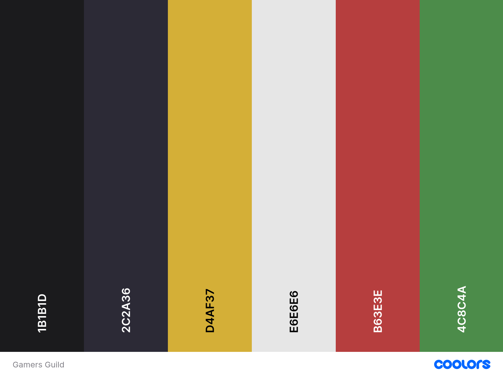
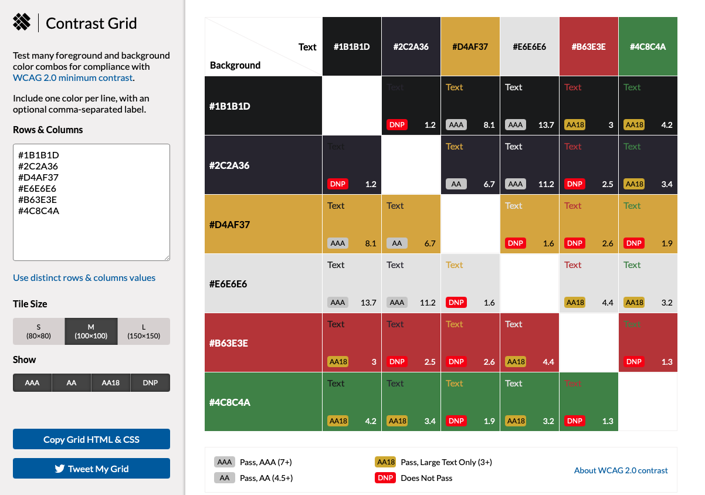

# Gamers Guild

Deployed link: [Gamers Guild]( "Gamers Guild | Heroku")

## Contents
* [Project Overview](#project-overview)
* [User Goals](#user-goals)
* [User Stories](#user-stories)
* [Project Goals and Objectives](#project-goals-and-objectives)
* [Target Audience](#target-audience) 
* [Wireframes](#wireframes)
* [Design Choices](#design-choices)
  + [Typography](#typography)
  + [Colour Scheme](#colour-scheme)
  + [Images](#images)
* [Security Measures and Protective Design](#security-measures-and-protective-design)
  + [User Authentication](#user-authentication)
  + [Password Management](#password-management)
  + [Form Validation](#form-validation)
  + [Database Security](#database-security)
* [Features](#features)
  + [Core Features](#core-features)
  + [Shop Features](#shop-features)
* [Future Enhancements](#future-enhancements)  
* [Technologies Used](#technologies-used)  
  + [Languages](#languages)  
  + [Libraries and Frameworks](#libraries-and-frameworks)  
  + [Tools and Programmes](#tools-and-programmes)  
* [Database Design and Data Modelling](#database-design-and-data-modelling)  
  + [Data Model](#data-model)  
  + [Entity Relationship](#entity-relationship)  
  + [Entity Relationship Diagram](#entity-relationship-diagram)  
* [Testing](#testing)  
  + [Bugs](#bugs)  
  + [Responsiveness Tests](#responsiveness-tests)  
  + [Code Validation](#code-validation)  
  + [Automated Testing](#automated-testing)  
  + [User Story Testing](#user-story-testing)  
  + [Feature Testing](#feature-testing)  
  + [Error Page Testing](#error-page-testing)  
  + [Accessibility Testing](#accessibility-testing)  
  + [Lighthouse Testing](#lighthouse-testing)  
  + [Browser Testing](#browser-testing)  
* [Deployment](#deployment)  
  + [Local Deployment](#local-deployment)  
  + [Heroku Deployment](#heroku-deployment)  
* [Credits](#credits)
  + [Feedback, advice and support](#feedback-advice-and-support)
  + [Learning Resources and Guidance](#learning-resources-and-guidance)
  + [Images](#images)
  + [Content](#content)
  + [Visual Content](#visual-content) 

----------------------------------------------

## Project Overview
Gamers Guild is a full stack Django web application designed to bring gamers together within a shared, community-driven platform. The application enables users to browse a curated collection of games, explore detailed game pages, and engage with other users through interactive features such as comments, reviews, and personalised content.

The platform prioritises clarity, usability, and meaningful interaction, avoiding unnecessary complexity or distractions. By focusing on community-driven content rather than algorithm-heavy recommendations, Gamers Guild encourages users to share experiences, discover new games organically, and contribute to a collaborative environment.

Built using Django, the project demonstrates full CRUD functionality, secure authentication, and relational database design. It showcases the integration between backend logic and frontend presentation, ensuring a seamless and responsive experience across all devices.

In addition to its community features, Gamers Guild includes an integrated shop that allows users to browse and purchase gaming-related accessories and add-ons. These include items such as customisable game pieces, themed accessories, and enhancements that complement gameplay. This expands the platform beyond discussion into a more complete user experience, while also demonstrating e-commerce functionality within a full stack application.

**Purpose:**

The purpose of Gamers Guild is to provide a welcoming and interactive platform where gamers can explore, discuss, and share their experiences in a structured and engaging environment.

Many existing gaming platforms rely heavily on ratings, advertisements, or algorithm-driven suggestions, which can limit authentic interaction. Gamers Guild addresses this by prioritising user-generated content, allowing users to communicate through comments and discussions rather than relying solely on numerical systems.

The inclusion of a shop enhances this experience by connecting community interaction with practical user needs. Users can move seamlessly from discovering games and engaging in discussions to purchasing related accessories and enhancements, creating a cohesive and engaging user journey.

**Key objectives include:**

- Encourage open discussion and sharing of gaming experiences  
- Support discovery of new games through community insight  
- Provide a clean, distraction-free interface  
- Demonstrate secure and scalable Django development  
- Integrate e-commerce functionality within a community platform   

**Target Audience:**

Gamers Guild is designed for a broad range of users who engage with gaming content in different ways:

- Casual gamers looking to discover new games and read community opinions  
- Enthusiast gamers who enjoy discussion, reviews, and sharing experiences  
- Beginner to intermediate players seeking guidance and recommendations  
- Users who prefer community-driven platforms over commercial review sites  
- Players interested in saving and organising favourite games  
- Individuals who value a clean, user-friendly interface  

The platform also appeals to users interested in gaming-related purchases:

- Gamers looking for accessories, collectibles, or add-ons  
- Users who enjoy customising their gaming experience  
- Players who value the convenience of browsing and purchasing within one platform 

**Platform:**

Gamers Guild is a fully responsive web application designed using a mobile-first approach, ensuring usability across desktop, tablet, and mobile devices.

The platform supports multiple levels of user interaction:

- **Public Users**  
  Can browse games, view details, and read discussions without registering  

- **Authenticated Users**  
  Can register, log in, post, edit, and delete comments or reviews, and save favourite games  

- **Administrators**  
  Have full control over content, including managing games, moderating user-generated content, and maintaining platform quality  

The platform also includes an integrated shop system:

- **Shop Functionality**  
  Users can browse products, view detailed descriptions, and make purchases  

- **Authenticated Users (Extended Features)**  
  Logged-in users can purchase items, enhancing engagement and usability  

- **Administrators (Shop Control)**  
  Admins can manage inventory, including adding, editing, and removing products  

The application is deployed online and built with scalability, security, and maintainability in mind using Django’s built-in tools and best practices.

[Back to contents](#contents)

---------------------------------------------

## User Goals

- Browse and discover new games easily  
- Read and contribute to community discussions  
- Create an account to interact with content  
- Save favourite games for quick access  
- Access the platform across multiple devices  
- Purchase gaming-related products easily and securely  
- Explore and customise their gaming experience through accessories and add-ons

[Back to contents](#contents)

---------------------------------------------

## User Stories

| User Story | Expected Outcome | Pass Criteria | Evidence |
|------------|----------------|---------------|----------|
| As a public user, I want to browse a list of games and view individual game details so that I can explore the content without registering. | Public users can see game titles, images, descriptions, and links to more details. | Game list displays correctly, detail pages load without login. |  |
| As a new user, I want to register an account securely so that I can participate in discussions and save favorites. | Users can register with validation, receive success feedback, and verify account details. | Registration form validates input and displays confirmation message. |  |
| As a registered user, I want to log in securely so that I can access my profile and interact with content. | Users can log in with credentials, authentication protects private data. | Login form accepts valid credentials and denies invalid attempts. |  |
| As a logged-in user, I want to post reviews or comments on games so that I can share my opinions and interact with other users. | Comments/reviews are posted under the game, with moderation if needed. | Comment form works and displays posted reviews after submission. |  |
| As a user, I want to edit my own reviews/comments so that I can correct mistakes or update my opinion. | Users can update their own comments, changes are saved and marked as edited. | Only comment author can edit, edit confirmation displayed. |  |
| As a user, I want to delete my own reviews/comments so that I can remove content I no longer want visible. | Users can delete their own comments after confirmation, removed content is gone from display. | Delete confirmation and success feedback function correctly. |  |
| As a registered user, I want to save my favorite games so that I can easily revisit them later. | Users can “favorite” games and view a personal list in their profile. | Favorite button toggles correctly, saved games appear in user profile. |  |
| As an admin, I want to add new games or content so that fresh material is available to the community. | Admins can create new games through the admin panel, new content appears on the site. | Admin can create game entries with images, description, and metadata. |  |
| As an admin, I want to edit existing games or content so that I can correct errors or update information. | Admins can update game details, changes reflect immediately on front end. | Changes are saved successfully and visible to users. |  |
| As an admin, I want to delete outdated or inappropriate games so that the content remains current and safe. | Admins can remove content, confirmed via admin panel, removed items no longer appear to users. | Delete confirmation displayed, database updated correctly. |  |
| As an admin, I want to moderate user comments/reviews so that inappropriate or spam content is removed. | Admins can approve, decline, or delete comments, moderation reflected on front end. | Only admins can perform moderation, moderated content is hidden or removed. |  |
| As a public or registered user, I want responsive design so that the website works well on mobile, tablet, and desktop. | Website layout adjusts seamlessly across devices. | No broken elements, navigation and content are readable at all screen sizes. |  |
| As a user, I want to browse products in the shop so that I can explore available gaming accessories. | Users can view a list of products with images, names, and prices. | Product list loads correctly and displays all items. |  |
| As a user, I want to view detailed product information so that I can make informed purchase decisions. | Users can access individual product pages with descriptions and details. | Product detail pages display correct information. |  |
| As an authenticated user, I want to add items to my cart so that I can purchase multiple products. | Users can add items to a cart and update quantities. | Cart updates correctly when items are added. |  |
| As a user, I want to complete a purchase securely so that I can buy products safely. | Users can complete checkout with secure handling of data. | Checkout process completes successfully with confirmation. |  |
| As an admin, I want to add products to the shop so that new items can be made available. | Admin can create product entries via admin panel. | New products appear in the shop. |  |
| As an admin, I want to edit products so that I can update pricing or descriptions. | Admin can update product details. | Changes reflect on frontend. |  |
| As an admin, I want to delete products so that outdated items are removed. | Admin can remove products from the database. | Deleted products no longer appear. |  |

[Back to contents](#contents)

---------------------------------------------

## Project Goals and Objectives

[Back to contents](#contents)

---------------------------------------------

## Target Audience

[Back to contents](#contents)

---------------------------------------------

## Wireframes

[Back to contents](#contents)

---------------------------------------------

## Design Choices

### Typography

### Colour Scheme

[Coolors](https://coolors.co/1b1b1d-2c2a36-d4af37-e6e6e6-b63e3e-4c8c4a "Coolors") was used to create a fitting colour scheme for Gamers Guild, it has been designed to create a dark, immersive medieval-fantasy atmosphere while maintaining strong usability and readability. A deep near-black (`#1B1B1D`) serves as the primary background to reduce eye strain and establish a moody foundation, complemented by a slightly lighter accent (`#2C2A36`) to add depth and separation between sections such as cards and panels. A rich gold (`#D4AF37`) is used for highlights, buttons, and key UI elements, evoking themes of treasure, armor, and prestige while standing out clearly against the dark background. A muted red (`#B63E3E`) provides contrast for alerts and important feedback, reinforcing a fantasy tone associated with danger or urgency. An additional complementary green (`#4C8C4A`) is used for success messages and positive user feedback. This earthy, muted tone fits naturally within the medieval-fantasy palette, resembling forest and herbal hues often associated with healing and vitality, while still providing clear visual distinction from error states. Finally, a soft off-white (`#E6E6E6`) ensures high readability for text without the harshness of pure white. Together, these colours create a cohesive, thematic interface that balances aesthetic immersion with accessibility and clear visual hierarchy. 

[Contrast Grid](https://contrast-grid.eightshapes.com/?version=1.1.0&background-colors=&foreground-colors=%20%231B1B1D%0D%0A%232C2A36%0D%0A%23D4AF37%0D%0A%23E6E6E6%0D%0A%23B63E3E%0D%0A%234C8C4A&es-color-form__tile-size=regular&es-color-form__show-contrast=aaa&es-color-form__show-contrast=aa&es-color-form__show-contrast=aa18&es-color-form__show-contrast=dnp "Contrast Grid") was used to determine the best colour combinations to ensure the website was visually appealing whilst remaining easy for the user to read the content.

|CSS Name               |HEX          |Use
|-----------------------|-------------|------------------------------------------------|
| --primary | `#1B1B1D` | Backgrounds (pages, sections, navbars) |
| --secondary | `#2C2A36` | Cards, panels, footers  |
| --primary-highlight | `#D4AF37` | BButtons, hover states, important text, borders |
| --text | `#E6E6E6` | Body text, headers, links |
| --secondary-highlight | `#B63E3E` | Alerts, error messages, warnings, accent highlights |
| --success | `#4C8C4A` | Success buttons (send, submit) |

### Images

[Back to contents](#contents)

---------------------------------------------

## Security Measures and Protective Design

### User Authentication

### Password Management

### Form Validation

### Database Security

[Back to contents](#contents)

---------------------------------------------

## Features

### Core Features

- Game listing and detailed game pages  
- User authentication (register, login, logout)  
- Comment and review system (CRUD functionality)  
- Favourite/save functionality  
- Admin content management  

### Shop Features

- Product listing and individual product pages  
- Add to cart functionality  
- Secure checkout process  
- Admin product management (CRUD)
- Intergration of e-commerce within a relational database  

[Back to contents](#contents)

---------------------------------------------

## Future Enhancements

[Back to contents](#contents)

---------------------------------------------

## Technologies Used

### Languages
- [CSS](https://developer.mozilla.org/en-US/docs/Web/CSS)  
- [HTML](https://developer.mozilla.org/en-US/docs/Web/HTML)  
- [JavaScript](https://developer.mozilla.org/en-US/docs/Web/JavaScript)  
- [Python](https://www.python.org/)  

### Libraries and Frameworks
- [Bootstrap v5.3](https://getbootstrap.com/)  
- [Django](https://www.djangoproject.com/)  
- [Font Awesome](https://fontawesome.com/)  
- [Google Fonts](https://fonts.google.com/)  

### Tools and Programmes
- [Black](https://pypi.org/project/black/)  
- [Dev Tools](https://developer.chrome.com/docs/devtools)  
- [GitHub](https://github.com)  
- [Heroku](https://www.heroku.com/)  
- [W3C Validators](https://validator.w3.org/)  
- [Lighthouse](https://developer.chrome.com/docs/lighthouse/)  
- [Contrast Grid](https://contrast-grid.eightshapes.com/)  
- [Coolors](https://coolors.co/)  

[Back to contents](#contents)

---------------------------------------------

## Database Design and Data Modelling

### Data Model

The Gamers Guild database supports both community interaction and e-commerce functionality. Entities include:  

- **User** – Registered accounts, roles, and profile information  
- **Game** – Game entries including title, description, media, genre, and related data  
- **Comment/Review** – User-generated content linked to games.
- **Product** – Shop items including name, description, price, image, and stock level  
- **Order** – Represents a completed purchase with transaction details   

### Entity Relationship

- A User can create multiple Comments (1-to-many)  
- A Game can have multiple Comments (1-to-many)  
- Each Comment is linked to one User and one Game  

**Shop Relationships:**

- A User can have multiple Orders (1-to-many)  
- An Order contains multiple Products (many-to-many)
- A Product can appear in multiple Orders

### Entity Relationship Diagram

[Back to contents](#contents)

---------------------------------------------

## Testing

### Bugs
| Bug Description | Resolved | Resolution Description |
|-----------------|----------|-----------------------|
| Example bug | Yes/No | Example fix description |

### Responsiveness Tests

### Code Validation

### Automated Testing

### User Story Testing
## User Story Testing Table

| User Story | Expected Outcome | Result | Pass/Fail | Evidence |
|------------|----------------|--------|-----------|----------|
| Browse games as a public user | Public users can view game titles, images, descriptions, and details without logging in | | |  |
| Register a new account | Users can register with validation and receive confirmation feedback | | |  |
| Login securely | Users can log in with valid credentials and are denied with invalid ones | | |  |
| Post reviews/comments | Logged-in users can submit comments that appear under game details | | |  |
| Edit own comments | Users can update their own comments and see confirmation feedback | | |  |
| Delete own comments | Users can delete their own comments with confirmation | | |  |
| Save favourite games | Users can favourite games and view them in their profile | | |  |
| Admin adds new game | Admin can create new game entries via admin panel | | |  |
| Admin edits game | Admin can update game details and changes reflect on frontend | | |  |
| Admin deletes game | Admin can remove games and they no longer appear on the site | | |  |
| Admin moderates comments | Admin can approve, decline, or delete comments | | |  |
| Responsive design | Site adapts correctly across mobile, tablet, and desktop | | |  |
| Browse shop products | Users can view a list of products with images, names, and prices | | |  |
| View product details | Users can access individual product pages with full details | | |  |
| Add items to cart | Users can add products to cart and update quantities | | |  |
| Complete purchase | Users can securely complete checkout and receive confirmation | | |  |
| Admin adds product | Admin can create new products via admin panel | | |  |
| Admin edits product | Admin can update product details such as price and description | | |  |
| Admin deletes product | Admin can remove products and they no longer appear in shop | | |  |

### Feature Testing

### Error Page Testing

### Accessibility Testing

### Lighthouse Testing

### Browser Testing

[Back to contents](#contents)

---------------------------------------------

## Deployment

### Local Deployment

### Heroku Deployment

[Back to contents](#contents)

---------------------------------------------

## Credits

### Feedback, advice and support

- [Richey Malhotra](https://github.com/richey-malhotra "GitHub | richey-malhotra")

### Learning Resources and Guidance

- [Code Institute](https://codeinstitute.net/ "Code Institute")
- [MDN](https://developer.mozilla.org/en-US/ "MDN | Homepage")
- [Slack](https://slack.com/intl/en-gb/ "Slack")
- [Stack Overflow](https://stackoverflow.com/ "Stack Overflow")
- [W3 Schools](https://www.w3schools.com/ "W3 Schools")

### Images:

### Content:

- 

### Visual Content:

- 

[Back to contents](#contents)